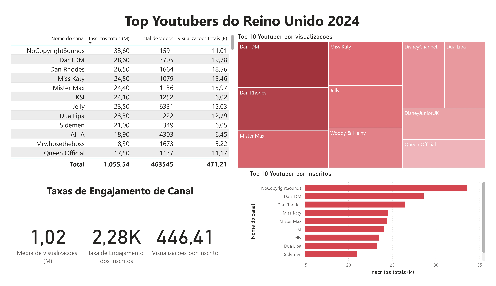

# Projeto de dados (Excel -> SQL -> Power BI)

## Limpeza de dados

- Quais são os problemas principais com os dados atuais?

1. Existem valores nulos nos dados.
2. A primeira coluna contém o ID do canal com o que parece ser IDs de canal, que são separados por um símbolo @ - precisamos extrair os nomes dos canais a partir disso.
3. Algumas das células e nomes das colunas estão em um idioma diferente - precisamos confirmar se essas colunas são necessárias, e, se sim, precisamos abordá-las.
4. Temos mais dados do que precisamos, então algumas dessas colunas precisariam ser removidas.

## Limpeza de dados
- O que esperamos que os dados limpos contenham? (O que eles devem conter? Que restrições devemos aplicar a eles?)

O objetivo é refinar nosso conjunto de dados para garantir que ele esteja estruturado e pronto para análise.

Os dados limpos devem atender aos seguintes critérios e restrições:

- Apenas colunas relevantes devem ser mantidas.
- Todos os tipos de dados devem ser apropriados para o conteúdo de cada coluna.
- Nenhuma coluna deve conter valores nulos, indicando dados completos para todos os registros.

Abaixo está uma tabela que descreve as restrições no nosso conjunto de dados limpo:

| Propriedade | Descrição |
| --- | --- |
| Número de Linhas | 100 |
| Número de Colunas | 4 |

E aqui está uma representação tabular do esquema esperado para os dados limpos:

| Nome da Coluna | Tipo de Dados | Nulável |
| --- | --- | --- |
| nome_do_canal | VARCHAR | NÃO |
| total_de_inscritos | INTEGER | NÃO |
| total_de_visualizações | INTEGER | NÃO |
| total_de_vídeos | INTEGER | NÃO |

- Quais passos são necessários para limpar e formatar os dados no formato desejado?

1. Remover colunas desnecessárias selecionando apenas as que você precisa
2. Extrair nomes dos canais do Youtube a partir da primeira coluna
3. Renomear colunas usando aliases

### Transformar os dados

```sql
/*
# 1. Selecionar as colunas necessárias
# 2. Extrair o nome do canal da coluna 'NOMBRE'
*/

-- 1.
SELECT
    SUBSTRING(NOMBRE, 1, CHARINDEX('@', NOMBRE) -1) AS nome_do_canal,  -- 2.
    total_de_inscritos,
    total_de_visualizações,
    total_de_vídeos

FROM
    top_uk_youtubers_2024
```

### Criar a visualização SQL

```sql
/*
# 1. Criar uma visualização para armazenar os dados transformados
*/

CREATE VIEW clean_top_uk_youtubers_2024 AS
SELECT
    SUBSTRING(NOMBRE, 1, CHARINDEX('@', NOMBRE) -1) AS nome_do_canal,
    total_de_inscritos,
    total_de_visualizações,
    total_de_vídeos
FROM
    top_uk_youtubers_2024
```

## Estratégia de Colaboração

### Identificar Colaboradores Potenciais
- Quais influenciadores foram identificados como os melhores para colaborar?

Com base em nossa análise, os três principais canais do Youtube para colaboração são:

1. NoCopyrightSounds - Possui o maior número de inscritos e visualizações totais.
2. DanTDM - Famoso por seu conteúdo de jogos e tem uma grande base de seguidores.
3. Dan Rhodes - Conhecido por seus truques de mágica e vídeos curtos que geram alto engajamento.

### ROI Potencial
- Qual ROI esperamos se seguirmos esse curso de ação?

1. Estabelecer um acordo de colaboração com Dan Rhodes poderia gerar um lucro líquido de $1.065.000 por vídeo.
2. Um contrato de marketing de influenciadores com Mister Max poderia gerar um lucro líquido de $1.276.000.
3. Se optarmos por uma campanha de colocação de produtos com DanTDM, isso poderia gerar aproximadamente $484.000 por vídeo. Se avançarmos com um acordo de campanha de marketing de influenciadores, isso resultaria em um lucro líquido único de $404.000.
4. NoCopyrightSounds poderia gerar um lucro de $642.000 por vídeo.

### Plano de Ação
- Que curso de ação devemos tomar e por quê?

Com base em nossa análise, acreditamos que o melhor canal para avançar com um acordo de parceria de longo prazo para promover os produtos do cliente é o canal Dan Rhodes.

Vamos conversar com o cliente de marketing para prever o que eles também esperam dessa colaboração. Uma vez que observemos que estamos atingindo as metas esperadas, avançaremos com parcerias potenciais com os canais DanTDM, Mister Max e NoCopyrightSounds no futuro.

- Quais passos devemos seguir para implementar as decisões recomendadas de maneira eficaz?

1. Entrar em contato com as equipes por trás de cada um desses canais, começando com Dan Rhodes.
2. Negociar contratos dentro dos orçamentos alocados para cada campanha de marketing.
3. Iniciar as campanhas e acompanhar o desempenho de cada uma delas em relação aos KPIs.
4. Revisar como as campanhas foram, coletar insights e otimizar com base no feedback dos clientes convertidos e do público de cada canal.


## Anexo de visualização

